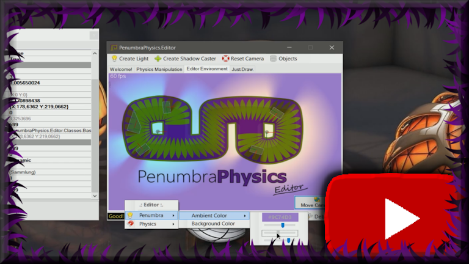

# Welcome to the PenumbraPhysics.Editor! 
It's a compound of **WindowsForms**, **MonoGame**, **FarseerPhysics** and **Penumbra** and it shows the possibility of creating something like an editor inside a windows forms control using the above mentioned framework and (modified) libraries. It is possible to create an **updatable** control window, which allows **realtime editing**, as well as a normal draw window - depending on your needs.

[](https://youtu.be/vQAxXN_V3X4)

Watch the video on **YouTube** by clicking on the image!

### Building

The following is required to successfully compile the solution:

- MonoGame 3.6 (WindowsDX)

(![Original Source [GitHub]](https://github.com/MonoGame/MonoGame))
<a href="http://www.monogame.net/">(Original Source [Website])</a>

- FarseerPhysicsEngine (modified source included)  

(![Original modified Source [GitHub]](https://github.com/sqrMin1/Farseer-Physics-TestBed-Port-MonoGame-3.6))
(![Original UpToDate Source (VelcroPhysics) [GitHub]](https://github.com/VelcroPhysics/VelcroPhysics))

- Penumbra (modified source included) 

(![Original Source [GitHub]](https://github.com/discosultan/penumbra))

- Visual Studio 2015

### How To
#### Creating a simple draw control:

You just need to create a new class and inherit from **GraphicsDeviceControl**. After that you need to implement the abstrakt members of it. They are **Draw()** and **Initialize()**.

A full drawable implementation looks like this:

```c
using Microsoft.Xna.Framework;
using Microsoft.Xna.Framework.Content;
using Microsoft.Xna.Framework.Graphics;
using Color = Microsoft.Xna.Framework.Color; //Xna.Framework.Color is different from System.Drawing.Color
    
    public class TestDrawControl : GraphicsDeviceControl
    {
        ContentManager Content { get; set; }
        SpriteBatch spriteBatch { get; set; }
        
        protected override void Initialize()
        {
            Content = new ContentManager(Services, "Content");
            spriteBatch = new SpriteBatch(GraphicsDevice);
        }

        protected override void Draw()
        {
            GraphicsDevice.Clear(Color.CornflowerBlue);

            spriteBatch.Begin();

            // Draw something!

            spriteBatch.End();

            Invalidate(); // You need this to reflect drawing changes in the control.
        }
    }
```

That's it! Now you are ready to draw what ever you want inside the **TestDrawControl**. After you built the solution, it's now possible to add this new control from your toolbox into the Forms.Designer.

#### Creating an updatable control (based on GameTime):

This time you need to inherit from **GameControl**. Inside the **GameControl** class you will find things like a **StopWatch** and the **GameTime** reference. There are also fields for catching the relative mouse position and button pressed events as well as some abstract physics functions you need to implement, but don't need to use. The real update cycle is generated inside the **GameLoop()** method. Other than that **GameControl** itself is inheriting from **GraphicsDeviceControl**, so it also contains the drawing feature.

A full implementation of a class inheriting from **GameControl** looks like this:

```c
using System;
using Microsoft.Xna.Framework;

    public class PenumbraPhysicsControlSAMPLE : GameControl
    {
        public PenumbraPhysicsEditor Editor;

        protected override void Initialize()
        {
            base.Initialize();

            Editor = new PenumbraPhysicsEditor(_graphicsDeviceService);
            Editor.Initialize();

            VisibleChanged += PenumbraPhysicsControlSAMPLE_VisibleChanged;
        }

        private void PenumbraPhysicsControlSAMPLE_VisibleChanged(object sender, EventArgs e)
        {
            ResetPhysics();
        }

        public override void ClearPhysicsForces()
        {
            Editor.ClearPhysicsForces();
        }

        public override void ResetPhysics()
        {
            Editor.ResetPhysics();
        }

        public override void SaveAllPositions()
        {
            Editor.SaveAllPositions();
        }

        protected override void Update(GameTime gameTime)
        {
            Editor.Update(gameTime, _MousePosition, LeftMouseButtonPressed);
        }

        protected override void Draw(GameTime gameTime)
        {
            Editor.Draw(gameTime);
        }
    }
```

You will notice that a **Editor** class is declared in the fields section. This is your actual **Game** which should run inside the control. You can trigger methods from this class to update and draw things.

This is how a reduced version (bare basics implementation) of the editor looks like:

```c
using System;
using System.Collections.Generic;
using FarseerPhysics;
using FarseerPhysics.Dynamics;
using Microsoft.Xna.Framework;
using Microsoft.Xna.Framework.Graphics;
using Penumbra;
using PenumbraPhysics.Editor.Classes.Basic;

    public class PenumbraPhysicsEditor : GFXPhysicsService
    {
        public PenumbraPhysicsEditor(IGraphicsDeviceService graphics)
        {
            // Base initializing
        
            // Initialize GFX-System
            InitializeGFX(graphics);

            // Initialize Physics-System
            InitializePhysics(graphics.GraphicsDevice, Content);
        }

        public void Initialize()
        {
            // Do your game / editor related initializing here
        }

        public void Update(GameTime gameTime, Vector2 mousePosition, bool leftMouseButtonPressed)
        {
            // Do your game / editor related updates here

            // Updates the shadow hulls of phyisical bodies
            UpdateShadowHulls();
            
            // Updates the interaction between you and the physics (mouse manipulation)
            // You only need this if it should possible to manipulate the physics with your mouse cursor
            UpdatePhysicsManipulation(leftMouseButtonPressed, mousePosition);
            
            // Updates the physical world
            UpdatePhysics(gameTime);
            
            // Updates fps counter and debug related stuff
            UpdateDisplay(gameTime, mousePosition);
        }

        public void Draw(GameTime gameTime)
        {
            // Do your game / editor related drawings here
        
            // FPS counter update
            UpdateFrameCounter();

            // Everything between penumbra.BeginDraw and penumbra.Draw will be
            // lit by the lighting system.

            Penumbra.BeginDraw();

            graphics.Clear(BackgroundColor);

            // Everything you draw here is affected by the shadow and lighting system
            
            Penumbra.Draw();

            // Everything you draw here is NOT affected by the shadow and lighting system
            // You should draw interface related stuff here
            
            // Draws the physical debug view like shapes and polygons
            DrawPhysicsDebugView();
            
            // Draws the debug display (fps counter and such)
            DrawDisplay();
        }
    }
```

You will notice that the editor inherits from **GFXPhysicsService**. I created some interfaces and service classes, which should make your life easier. The **GFXPhysicsService** contains the most important methods and references of the **GFX** and the **Physics** system. Feel free to take a look at the:

- 
- 

Adjust or expand those classes as you wish!

Finally you build your solution and put the newly created control inside your desired windows form. Done!

### Some interesting things and helpers

I also created the bare basics of **UITypeEditors**, **TypeConverters** and **HelperClasses** on which you could and should build upon! You can find the inside the source libraries in the folder **EditorSpecific**:

- 
- 

In first place they make it possible to easily exchange data between the property grid and the editor. 

### Samples

- **DrawControl**: A very simple draw control. It's not updatable but drawable and very simple.
- **WelcomeUpdateControl**: A very simple update control. It shows the bouncing PenumbraPhysics.Editor logo.
-	**PenumbraPhysicsControl**: A simple updatable control, which shows how the physics manipulation works.
- **PlacementControl**: An extendend updatable control sample, which shows how to build up a real editor environment.

#### Have fun and !
